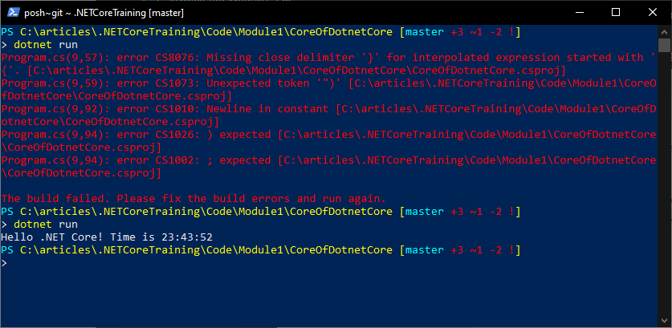

# An overview of .NET Core and ASP.NET Core

*prepared for:*  [Southwest Fox 2019](http://www.swfox.net/)  
*October 4th, 2019*  

[Session Materials](https://github.com/RickStrahl/SWFOX2019_DotnetCore)

## An Introduction to .NET Core
The first version of .NET Core was officially released in June of 2016. It has been around for 3 years now and can no longer be considered a 'new' technology. Yet in a way it still feels like brand new technology with a lot of .NET developers not having made the jump to .NET Core.

If you're coming from the full .NET Framework, .NET Core is a mixed bag of very familiar and new concepts and functionality. For the most part, the things you've learned in nearly 20 years of .NET development still apply. But there are many new ideas and features in .NET Core that improve upon 'classic .NET'.

## Rethinking the .NET Platform
At its core .NET Core is a complete re-imagining of .NET. It's designed from the ground up with modern architectural concepts at heart. .NET Core aims to provide the following:

* Ultra High Performance
* Cross-platform: Runs on Windows, Linux and Mac
* Modern development features out of the box
* Portable, Command line tooling for everything
* Open Source: All of .NET Core and ASP.NET Core are designed in the open
* Side by Side Deployment
* Familiar .NET platform for .NET Framework developers

This is I can hardly live without. You can type on the current word and if I like what I see I won't tell you that there's a problem.

Microsoft nailed the first three bullets with the first versions .NET Core 1.x, but tooling and meeting .NET feature expectations for the majority of .NET developers took quite a bit longer until version 2.x and now 3.x. .NET Core has steadily improved and now that it has arrived at v3.0 - typical for Microsoft standards - it has matured into a powerful, stable and consistent development framework that boosts some of the best performance for a generic toolset in the industry.

### Performance 
One of the main arguments for .NET Core is that it's a highly optimized platform for running high performance Web applications. While the classic .NET Framework was by no means slow, it was never a contender in the speed records achieved by other Web platforms providing light weight server platforms. 

Unlike full framework which was Windows specific and tied very closely to Microsoft's IIS Web Server, .NET Core by default is not tied to a specific platform or Web server. Instead it provides a very light weight core, which translates into a much smaller memory footprint along with fine control over what features are provided out of the box. You can opt into features and use only those features you actually need to use in your application.

As a result .NET Core has been successfully designed to become a highly optimizable server platform and is now **one of the fastest general purpose Web frameworks** according to a number of benchmarks that measure server application performance (see [TechEmpower Benchmarks](https://www.techempower.com/benchmarks/)) placing in the top ten of many benchmarks for all types of Web servers. Note when looking at those benchmarks you need compare to comparable tools and platforms like NodeJs/Express, PHP and Java for an apples to apples comparison.

These performance gains come from the small, modular nature of .NET Core, but also because Microsoft has spent an inordinate amount of time optimizing .NET Core's server components to make sure they are optimized for high performance and low memory scenarios. Unlike with Classic .NET, Microsoft is actively pursuing max performance for ASP.NET Core and with the help of community supported contributions, this has been an amazing effort to watch.


There's a lot of effort in recent versions of .NET Core to provide framework and language features like `Span<T>`, `Memory<T>` and friends that reduce memory usage and improve overall throughput at all levels of the framework. This results in much faster server code, but as of .NET 3.0 these changes are also slowly rippling through the rest of the .NET Core base libraries and are starting to impact all aspects of the entire .NET Core stack. As a developer this means you get a much improved performance without having to make code changes which is always a big winner!

### Cross Platform
Full .NET Framework was always tied to Windows, and classic ASP.NET was tied closely to Microsoft's Internet Information Server. In the modern world where the majority of online application code does not run on Windows, support for cross platform applications is no longer optional and Microsoft realized that .NET had to support cross-platform in order to survive. Further, many of the new cloud technologies like Docker and Kubernetes rely on Linux images to run effectively.

With .NET Core it's possible to create applications that run on Windows, Linux or the Mac from a single code base. Code can be easily built for each platform with the built-in tooling support and the compile time tools are available as part of the runtime so it's easy to create container images that can build the code for the appropriate platform at deployment time.

For ASP.NET Core the key feature is the Kestrel Web Server that's part of the ASP.NET Core platform and that allows to essentially self-host a .NET Core Web server in a console application. On each platform, these .NET Core Console applications can either be executed directly or sit behind a Web Server proxy that provides the Web front end and routes dynamic requests to the the .NET app.

ASP.NET Core also provides special Windows implementation of the Web Server interface to work natively and in-process in IIS, or with raw `Http.sys`, but each of these custom implementations are simply drop in replacements for the Web server.

It's also easy to build .NET applications on platforms other than Windows - in fact many developers these days work with .NET Core on a Mac or on Linux. However, the beauty of cross platform support is that you have a choice - you can build and run your applications on any of the supported platforms and assuming you stick to platform agnostic features - which is easier than you might think especially for server applications - you can easily switch back and forth between platforms.

### Modern Development Features
One of the big improvements in .NET Core is that there are a number of built in services that are available to all .NET Core applications consistently. .NET Core comes with a build in Dependency Injection (DI) system that makes it easy to use DI especially in your Web applications where most components of the framework itself are provided through DI. 

Related to DI is the service configuration interface that provides a standard way for applications to configure themselves with common `ConfigureServices()` and `Configure()` methods. These two methods allow for setting up services during startup and hook up functionality like Middleware pipelines in ASP.NET for example. Although this model depends on the particular application framework (ie. ASP.NET Core) that you use but Microsoft has been using the same model for most frameworks provided so far.

.NET Core also includes a sophisticated configuration storage and retrieval system that allows for staggered configuration stores that can read configuration information from multiple stores. Configuration values can be read from JSON files, command line parameters, environment variables, a user secrets store or an online configuration service with settings incrementally applied from each store in combination. Configuration is just 'there' for you to use after initial setup in the application's startup.

Likewise .NET Core provides for simple, built in logging and tracing APIs that are easily extendable. Logging is extremely important these days of cloud deployments, and with .NET Core's logging APIs it's easy to log information consistently to different configuration stores. This is not a new feature - it's been available with third party libraries for years - but .NET Core provides these features natively along with useful support features that can expose that logging data in useful ways.

ASP.NET Core is based on a simple yet very capable **Middleware Pipeline** that makes it easy to hook into the core ASP.NET Core processing, and with relative ease provide flexible extensibility. Middleware provides inbound and outbound hooks that let you inspect and modify content both on the inbound request and outgoing response - and everything in between.  Middleware is a common concept in Web Frameworks and ASP.NET Core uses this same concept to full effect so much so that just about every framework or tool component you interact with ASP.NET Core is based on middleware components large and small.

### Command Line Tooling and Simpler Project Formats
All .NET Core tooling is implemented via command line tools that can be automated by any application that wants to use the tools. Although .NET has always had command line tools to build projects via MS Build in the past, that process was never easy due to the complexity of the tools as well as the complicated project formats that .NET projects used.

In .NET Core a new and much simpler SDK style project format is used that uses an *include all by default* approach. All known files are considered included in the project by default, and you can then specify special behavior like excluded files or files that need custom behavior added such as special copy directions. This results in much leaner and cleaner project files that are human editable and easy to reason about. They are also much more source control friendly as there fewer operations that require the project file to be changed.

All the tooling is **command line driven** through the `dotnet` command, using simple explicit action commands like `restore`, `build`, `publish` and `run`. Operations like `add package` and `remove package` for NuGet packages can also be done through this CLI or - even easier in many cases - you can directly manage the packages inside of the project file.

All this adds up to a much easier process to manage large projects.

Finally, the command line tooling is really a requirement for DevOps automation. In order to build applications that run in docker containers for example, it's crucial that there's a simple command line interface to interact with the runtime to build and package applications to get them ready to run on the appropriate platform at deployment time.

One very important aspect of the new tooling is that although it's primarily built for building .NET Core applications, all the tooling is designed to build **any kind of .NET application**. You can use the new tooling and new SDK style projects even on older full framework .NET applications. 

Even better: You can now easily build **multi-targeted projects** that target .NET Core/.NET Standard and full Framework at the same time. You can even create fully packaged, multiple runtime targeted NuGet packages from a single project **just by compiling your project**. It's a great feature that is especially useful for anybody publishing shared libraries to NuGet.

### Side by Side Deployment
Another big selling point for .NET Core over full framework from Microsoft's end for Enterprise customers is that .NET Core can be deployed side by side. .NET Core offers several distribution mechanisms but all of them can be explicitly tied to a specific version of the .NET Core framework.

One of the big problems with the full .NET Framework has been Microsoft's wonky approach to patching the .NET Framework in place. .NET 4.0 and .NET 4.5, 4.6, 4.7, and now 4.8 all are in place updates that replace the previous version of the runtime. While Microsoft has always done an exemplary job of maintaining backwards compatibility between versions there are slight differences between these versions that have been known to break applications. Since there's only **one version of Full Framework** installed on a given machine, it's possible to break applications when a new version is installed, or even worse you might not be able to run an application because the machine is stuck on older version of the framework that can't be upgraded.

With .NET Core Microsoft provides two models for deployment:

* Installable Shared Runtimes 
* Fully Self-Contained Application Deployment

#### Installable Shared Runtimes
Installable runtimes are installed via downloadable installers from the [Microsoft .NET download site](https://dot.net). These runtimes contain the core .NET Core runtime, the basic build and run tools (only to build and run) and the CoreFx runtime files needed to get the base framework features. Additional installs may be required for frameworks that sit ontop the core runtime such as ASP.NET Core.

> #### .NET Core Runtime and ASP.NET Core are Separate
> ASP.NET Core is not part of the base .NET Core runtime, so you need to install the ASP.NET Core framework on top of .NET Core. The download is available at the same `dot.net` download site. Microsoft also has feature specific bundles available that put these packages into a single installable download. 

Downloadable runtimes are available for each individual version put out by Microsoft and these shared runtimes can be installed to match a particular version of an application. 

Shared runtimes can live side by side with each other and the runtime loader can figure out which version an application needs to use. Runtimes are also forward compatible within the next major version so if you have a .NET Core 2.1 application and only have the shared .NET Core 2.2 runtime installed the application will run. If both .NET Core 2.1 and 2.2 runtimes are installed the 2.1 application will use the nearest version or the 2.1 version that matches the application's targeted runtime.

This is a pretty good compromise between the in-place replacement version of Full Framework and the fully self-contained model.

#### Self Contained Deployment
.NET Core applications can also be deployed entirely on their own with all dependencies available in a local installation. All the required dependencies are stored in the application's folder and you can then run the application on any machine even if there's no prior trace of a .NET Core installation.

These installs are not small - the base install is somewhere around 140 megs plus your application, but for scenarios where an exact version is required, or where you know you are installing the application where .NET Core won't be installed for sure it's great to have to option to install an application that is 100% self-contained and portable.

Although these installs are large, these self-contained installs are sure to prove popular with many Enterprise customers that run many different kinds of applications side by side. Having applications completely isolated from each other with their own set of runtimes can solve a lot of compatibility issues.

### Open Source All The Things
.NET Core, ASP.NET Core and all of the related technologies like the tooling, the CLI, NuGet, the .NET languages etc. are now Open Source. Microsoft is building these tools in the open with all source code available on GitHub. Microsoft is also allowing contributions and a large percentage of feature improvements these days actually come from outside of Microsoft's internal staff.

This is a huge change from the previously closed Architecture of .NET and the various support platforms and it's resulted in a huge boost in improvements to the platform. Some of the biggest performance gains in .NET and ASP.NET Core in particular came from outside developers contributions.

The open nature has also brought a ton of open discussion about feature support and new features before those features ship. There is often very vocal discussion prior to new features finding their way into the projects and it gives every developer a voice. It's also now possible to directly file bugs against specific areas of the .NET Framework and bug reports are now managed directly by the people building the features as opposed to an impersonal bug reporting system in Visual Studio.

In short, the open source nature of .NET Core has completely changed the culture around how .NET works and how it is developed. It's been a very positive experience that has garnered a large community that is actively involved with .NET Core which is a huge improvement over 'the old Microsoft way'.

## The Road to .NET Core 3.0
So it's been 3 years since .NET Core was officially release and nearly another 2 years before that when it was first announced and the first pre-releases were made available. It's been a long road, and it's not been an easy one as the platform has organically grown from a relatively small footprint to a much more full featured platform that is closer in scope to what the original full framework supported.

As is typical for Microsoft it took a couple of versions for Microsoft to find .NET Core's solid footing. Version 1.x was very rough, followed by solid improvements in the 2.x versions that made it actually possible to move comfortably to .NET Core from full Framework. Version 3.0 continues the incremental improvement steps by providing many more compatibility features (as addon frameworks so they don't bloat the core) as well as huge improvements in performance.

As they say the magic version number for Microsoft is 3.0 and .NET Core 3.0 might be a good example of that.

### A rough .NET Core 1.0 Release
While the initial .NET Core 1.0 release was architecturally sound there were a lot of rough edges for developer convenience. The tooling was very rough, often crashing or not reporting accurate project information.

The initial 1.x versions also required that every small feature was imported into the project explicitly as micro-NuGet packages. This turned initial projects into an egg hunt of **NuGet Hell** where hundreds of packages were added to a project. Finding the right packages was tricky and often difficult to reason about because the dependency chain was huge. Building and distributing applications also required these packages making for massive self-contained installs.

### .NET Core 2.0
With the release of .NET Core 2.0 Microsoft fixed a lot of these problems with major improvements by:

* Bringing back a large swath of .NET Framework features
* Improving backwards API compatibility with .NET Framework
* Introducing .NET Standard 2.0
* Providing 'Framework' packages that removed much of NuGet Hell
* Fixing the tooling problems


All of these combined provided a good jumping in point for developers that previously were turned off by .NET Core's pseudo-.NET compatibility and the especially the NuGet hell issues. 

#### API Surface
The biggest feature of .NET Core 2.0 was that the **drastically improved API feature footprint** that more than doubled the number of APIs that are available over .NET Core 1.1. Microsoft brought back many of the well-known Full Framework, but non-platform specific .NET Framework APIs that makes it drastically easier to port Full Framework libraries to .NET Core. 
This change had a huge impact on the eco-system as it made it much easier for library authors to port their packages to .NET Standard or .NET Core and that brought back much of richness of support libraries for .NET Core that was sorely missing in .NET Core 1.x.

Today you can find most of the common components you expect with support for .NET Standard or .NET Core. 

#### .NET Standard 2.0
The other important thing that occurred in the 2.x timeframe, was the release of the .NET Standard 2.0 specification. .NET Standard is the source of a lot of confusion mainly because it's an abstract concept that is unique to .NET.

> #### .NET Standard is a Specification not an Implementation
> .NET Standard is a specification that describes specific feature implementations that a .NET Runtime like .NET Core, .NET Framework, Mono, Xamarin or Unity has to implement - at minimum - to support that version of the Standard.
>
> For library authors targeting .NET Standard provides the same feature set across all supported platforms - if it compiles to .NET Standard it'll very run on supported frameworks. For consumers it's an easy way to tell which platforms a .NET Standard component can work on.

**.NET Standard is a specification** that provides a contract for .NET Runtime implementers. A version of the standard specifies a set of APIs that the standard at minimum **has to implement** to be compliant. .NET Standard was released in version 1.0 shortly after .NET Core was initially released and the initial versions closely matched the API surface of .NET Core versions, but that meant that .NET Standard was missing a lot of features .NET developers took for granted in earlier versions of .NET.

For **runtime implementers .NET Standard is a blue print** of features that have to be supported. For **library implementers .NET Standard provides a common API target** to write to that **guarantees a user of a component that the library will work on any runtime platform supported** by .NET Standard 2.0.

At this point .NET Standard 2.0 is supported on all the major .NET platforms and today consumers of .NET Standard 2.0 libraries can find many .NET Standard 2.0 components that run on any of the supported platforms. It took a while for .NET Standard to take off, and find its optimal widely supported API feature set, but now .**NET Standard 2.0 offers a very functional and practical .NET baseline** both for library developers and library consumers. 

As a general rule, if you are library developer that wants to build components to run on any Runtime and platform, you probably want to implement your library using some version of .NET Standard. Each successively higher version of the standard offers more features than the previous one, with 1.0 providing the smallest footprint and 2.2 providing the most features. 

However, keep in mind there is no requirement for .NET Runtimes to implement a specific version of .NET Standard. For example, **.NET Standard 2.2 will not be supported on the full .NET Framework** as Microsoft has effectively stopped development of full framework. This effectively makes .NET Standard 2.0 the last version of the standard that runs on the most widely used version of .NET today.

But that may change. .NET Core 3.0 and the [.NET 5.0 initiative](https://devblogs.microsoft.com/dotnet/introducing-net-5/) that aims to combine all .NET Runtimes into a single runtime, is aimed at simplifying the .NET landscape into a single runtime that is capable of handling and the various workloads that are spread across the 4 separate major .NET Runtimes today. Some of this effort is already in place with .NET Core 3.0, which has added support for Windows specific frameworks like WPF and WinForms via add on libraries and special project extensions that know about these platforms. We can expect to see more of that, eventually with most frameworks migrating to .NET Core eventually.

### .NET Core 3.0
.NET Core 3.0 was recently released and it's an iterative update on .NET Core 2.2. The biggest improvements in .NET Core 3.0 are big performance gains throughout the framework, which is is a result of the new core Runtime performance features getting applied to the CoreFx runtime. In .NET Core 2.1 and 2.2 Microsoft first applied these new features to ASP.NET Core framework where huge performance gains were achieved propelling .NET Core to the top of various public performance benchmarks. In other words, .NET Core 3.0 receives performance gains throughout much of the entire platform from string operations to collection performance and so on.

.NET Core 3.0 also introduces a new service hosting model that is not tied to ASP.NET Core MVC that allows for alternate frameworks like gRPC to be hosted in a similar way as ASP.NET Core MVC applications. This allows .NET Core to be more flexible as new technologies come along that can be attached to the .NET Core base runtime.

Another feature of .NET Core 3.0 also provides support for Windows Desktop applications and specifically for building WPF and WinForms on top of .NET Core. This won't change that these applications are Windows only, but it does allow taking advantage of new .NET Core and C# features going forward that will only be available to .NET Core applications. While moving an existing .NET Framework application to .NET Core takes some effort, most of the work is setting up the new project and making sure all dependencies get included. The vast majority of Windows functionality and all of the WPF and Windows Forms features are available. For more info on what's involved check out this[ blog post on .NET Core 3.0 migration](https://weblog.west-wind.com/posts/2019/Apr/24/First-Steps-in-porting-Markdown-Monster-to-NET-Core-30). 

While there are no specific feature benefits of porting to .NET Core, it does provide a path forward for older Windows applications now that full .NET Framework has been designated as feature complete without future feature work enhancements. Converting to .NET Core allows you take advantage of feature improvements in the framework as well as improvements in the specific feature frameworks. We won't cover the desktop runtimes in this course, but it's good to know that you will also be able to use .NET Core 3.0 in that context.

## Runtimes, .NET Standard and Infrastructure
Let's take a look at the high level .NET Core based architecture as shown in **Figure 1**. The .NET Eco system is really made up by 3 main components which are:

* Infrastructure and Tooling
* The base Standard Library Specs (.NET Standard)
* The actual Runtime Implementations


<small>**Figure 1** - The .NET Platform now uses common set of tools to build for various specific .NET Implementations.</small>

On the bottom of **Figure 1** there are a common set of tools and languages that can be used for each of the platforms. The tooling is based on the .NET Core SDK and requires .NET Core to run, but the tooling is capable of building for all the supported platforms. It includes the various .NET Compilers, all the code languages, and the base runtime components needed to run the tooling. For .NET Core applications the SDK also includes the most common frameworks - in .NET Core 3.0 the ASP.NET Core and `Windows.Desktop` frameworks are included in the SDK install.

The .NET SDK tools allow for building a project **against multiple target frameworks simultaneously in a single project**. If you're a library author, it's now very easy to target say .NET 4.7.2 and .NET Standard 2.0 in a single project. When multi-targeting you probably have 99% feature overlap, with a small percentage of variation between the platforms. You can take advantage of each platform by providing a specific output assembly for that platform that includes some platform specific features. This is a very powerful feature that has made it possible for many full framework components to be more easily ported to .NET Standard or .NET Core without giving up features. The tooling is even smart enough to produce a single multi-targeted NuGet package from the project from a single build. Nice!

The tooling bits might be underappreciated, but the fact that there's now a single set of tools that can build for all platforms has made it much easier to create a consistent development environment. We'll see further enhancements here as .NET moves towards the unified .NET 5.0 platform in the future.

## What is .NET Core?
In a nutshell .NET Core is a new specific .NET runtime implementation. Like Full .NET Framework or Mono it's a runtime that provides the core foundation for hosting and executing an application. However, when we talk about a .NET Core as a platform, we're really talking about a combination of infrastructure, runtime and library components like CoreFx that make what we interact with when we build and run .NET Core applications. **Figure 2** looks similar to **Figure 1**, but with the .NET Core platforms filled in on the top part of the stack.


<small>**Figure 2** - The high level .NET Core Stack </small>

### .NET Standard Specification
.NET Core 3 implements .NET Standard 2.2 which also means it's .NET Standard 2.0 compliant. .NET Standard 2.2 is the latest version of .NET Standard, but note that **it does not support the Full .NET Framework**. Microsoft has stated that the current .NET 4.8 release is the last version of .NET Framework and that it won't see any further development except for bug fixes and security patches. .NET Framework is .NET Standard 2.0 compatible and that will be the last version of the Standard that it supports. This means that if you are building .NET Standard components only and need to support Full Framework you have to stick to .NET Standard 2.0. The alternative is to build a platform specific version via multi-targeting.

### CoreFx Base Library
On top of the .NET Core Runtime sits the **CoreFx library** that essentially provides all the base .NET Core API features. That's runtime types, assembly loading, host bootstrapping, base types, libraries like XML and JSON parsing and so on. Basically all the base features and types that you expect and interact with in code are contained in the CoreFx package.

### Feature Frameworks
On top of these core libraries sit the specific feature libraries that use all the features of the stack below it. These are frameworks like ASP.NET Core, Winforms and WPF and UWP, Windows Iot, Microsoft ML and so on. These feature frameworks bring their own set of libraries/packages that sit ontop of the base stack.

In this training we're only concerned with the ASP.NET Core Web stack, but the implementation concepts are similar for each of these frameworks. When you create a project you choose one of the target frameworks to work with, and the project system automatically references the appropriate target framework libraries required for that platform. In the case of ASP.NET Core as well as the desktop frameworks this brings in a set of framework packages that package the myriad of depedent packages into a single project reference added to a project. The compilers and build tooling then figures out which low level NuGet packages need to be deployed for an application to run based on dependencies actually taken in your application.

With .NET Core applications you get to choose whether you want to use pre-installed shared runtimes both for the core runtimes and feature frameworks, or whether you want to deploy a fully self-contained installation that includes all the dependencies of the application in a self-contained directory structure without any pre-requisites at all at the cost of a fairly large runtime install.

## ASP.NET Core
For this training we're focused on ASP.NET Core. ASP.NET Core is easily the most important framework for .NET Core to date. The base concepts of .NET Core originated in the ASP.NET team and most of the initial work and performance focus that has gone into .NET Core is really focused on the Web workloads that use ASP.NET Core.

ASP.NET Core is a feature framework as described earlier, that sits ontop of the core .NET Core runtime and it provides the server based network based functionality in .NET Core. Notice I didn't say *Web* or *HTTP* specifically, but rather refer to network based services. Although ASP.NET Core is mostly used for Web applications running over HTTP, starting with .NET 3.0 the framework has been abstracted so it can also work with non-HTTP transports. Currently there's nothing specifically using this but in the future if new technologies arrive that directly work over TCP/IP or other maybe new Network protocols that will now be possible with ASP.NET's stack. 

For our purposes in this training however, we'll be focusing on the HTTP transports and Web scenarios.

### Frameworks within a Framework within Frameworks...
ASP.NET Core is a very large framework and it includes a ton of different functionality. 

On the bottom of the ASP.NET specific stack is the core ASP.NET Core framework that handles the bootstrapping of the runtime and the basic wiring up of the middleware pipeline. It includes things like setting up the host and binding a `Startup` class with configuration hooks up to the base. This startup includes the configuration for the dependency injection services which are used for adding services that provide the actual feature functionality.

The middleware pipeline handles the basic request handling and routing functionality, but the real work is done via the middleware components that plug into this core pipeline. Anything that you do to write application logic in ASP.NET Core is implemented through middleware. Frameworks like ASP.NET Core MVC, SignalR, gRPC, a third party stack like ServiceStack and anything you choose to build on your own is built using middleware at its base. Figure 3 shows how the stack hangs together.

that includes a core base framework that manages the base request flow via middleware pipeline, and then several support libraries that run on top of this base framework. ASP.NET Core MVC, ASP.NET Core SignalR, ASP.NET gRPC are all examples of frameworks that sit on top of the core ASP.NET middleware pipeline.


<small>**Figure 3** - ASP.NET Core sits on top of the .NET Core framework and exposes a number of high level frameworks</small>

### The Middleware Pipeline
At the component and application level the middleware pipeline is really what drives **everything** in ASP.NET Core. Just about all useful functionality that you use in ASP.NET Core is implemented via middleware. From raw endpoint handlers that just **do one thing** for things like a Micro Service or very simple endpoint handler, to middleware filters that you can implement to intercept requests and add your own content to the request and response - it's all done through middleware. Middleware is the basic building block of extension in ASP.NET Core.

While it's very easy to create a fully self contained ASP.NET Core application that is self hosted in a single program file by using a terminating endpoint middleware (using `app.Run()`) what you can build with a single middleware handler can be an entire framework. In **Figure 3** all the frameworks listed at the very top are implemented as middleware components. Some of these create many more sub-components for the middleware pipeline but nevertheless it all flows through middleware as the basic entry point.

Middleware itself works like a daisy chain of event delegates that are strung together with a call to the `next();` item in the middleware chain. Take a look at **Figure 4** which shows how request flow through the middleware pipeline.


<small>**Figure 4** - Requests fire through the middleware components one after the other in both directions using First In, Last Out(FILO)</small>

The order in which middleware components are added to the pipeline is important and the first one in is called first. Each middleware component receives a `next()` delegate that is used to call the next element in the chain. Components are called in First In, First Out fasion which means that each middleware gets two shots at interacting with the request on the way in and on the way out. In between these two operations the `next()` call fires the next middleware component.

Because of this two-way interaction middleware is very powerful as it can look at request data as a request comes in, and at the generated output when a request is done.

Typically a full framework like ASP.NET Core MVC sits at the end of the middleware pipeline as a terminating middleware that generates the final output for a request. But... requests aren't done at the end of the chain, as the chain reverses and moves backwards through all the same middleware components in reverse. Previous bits of middleware can potentially add additional functionality to the output going response. An example, might be a response filter that adds Gzip compression, or a Live Reload component that adds some additional script to an HTML page to execute when the page renders.

### ASP.NET Core MVC
When you hear about ASP.NET Core, most of the time the discussion centers on higher level frameworks, rather than the middleware plumbing. The vast majority of Web applications build with .NET Core are ASP.NET Core MVC applications.
  
MVC is a Model View Controller framework that actually plays host to a couple of different not MVC technologies:

* MVC (the actual Model View Controller framework)
* Web API (for REST/Graph services)

While these two sub-frameworks appear to be very different in how they work and what they do, they do share a lot of commonality. In fact the main difference between an API and the an MVC style endpoint is how the data is rendered to the user. 

MVC returns data as HTML using a ViewEngine to turn result model data into an HTML result by using the Razor Scripting language that lets you execute .NET Code inside of an HTML template. The template is passed a model of data that contains the content, and the template's logic then renders the model data into HTML. Views typically have very little code and mainly display data that was generated by the Controller or a business object. The View main writes out simple data values, handles iteration over lists and collections, and provides for conditional rendering and formatting of data using limited amounts of code.  While it's recommended to use very little code in a view, Razor is actually very powerful and supports most of the .NET language features. In other words, it's possible to abuse Razor scripting and write lots of logic in script code, but it's definitely not recommended.

Web API provides the ability to create service or API endpoints from the same controller infrastructure used in MVC. The difference for an API is that you **return data** rather than HTML. API endpoints can either return raw data objects which are serialized into JSON (or XML which are the default supported output formats), or can output specific `ActionResult` results just like View pages do.  The latter allows for more flexibility with results as you can different types of result types. For example, you may have structured object result for an operation or a very specific error response in case of an error. Using `ActionResult` returns as opposed to returning a `CustomResponse` gives you more control over the response.

MVC and Web API seem very different but other than the final output type, the rest of the pipeline used for both is identical. Routing, request filtering, method interception and just about everything else these two sub-frameworks use are identical. In previous versions of .NET these frameworks were separate and it caused all sorts of consternation as developers had to build the same support infrastructure for two separate and different frameworks. So in ASP.NET Core Microsoft decided to roll them both into the same framework, which was a good call.

As a result you now use a single set of filters and attributes that apply to both MVC and Web API which can save a tremendous amount of duplication. You can even mix and match MVC and API actions in a single controller. For the most part it's a good idea to separate APIs and Views, but in some situations, especially for APIs it can be very useful to have one or two requests that serve View results.

### Razor Pages
Razor Pages is a relatively new feature of ASP.NET Core that was added with ASP.NET Core 2.x. Razor pages is a script centric MVC framework that relies on a single file, self-contained approach for Controller/View handling. Full MVC is very clear about the separation of Controller and View going so far as to completely moving the View and Controller into separate folders.

Razor Pages takes a different approach with Views that include code behind events that provide the Controller functionality. Script pages have request events like `OnGet()` and `OnPost()` that allow to handle specific operations against a razor page view. Code in Razor Pages can either be placed directly in the page in `@function()` block, or can be separated out into a separate class that sits side by side with the Razor Page templates. The functionality of Razor Pages is not very different than MVC as you still have controller like code that executes and passes its model data to the view. But the semantics of how the code and template are stored close to each other is very different. For the most part it's a matter of preference which approach you prefer.

## Summing Up
So this concludes this very high level look at the .NET Core and ASP.NET Core Eco system. There's a lot to .NET Core and even more to ASP.NET Core and we'll explore much of that in this training.

Keep in mind that we can't cover everything in the time we have to cover every bit of kit that comes in .NET Core and ASP.NET Core would take weeks to plow through. 

Our goal in this training is to give you a good overview of the key technologies that are available along with some good examples of how we use these technologies to build applications today.


## Getting Started with the Core of .NET Core
Time to get our feet wet! In this section I'll take you through creating an ASP.NET Core application from scratch - literally. I'll use the basic command line tooling and a text editor (Visual Studio Code) rather than the full blown Visual Studio. I'm not doing this because I love the command line or I think we should only use low level tools. It's because for understanding the underpinnings of .NET Core it can be really helpful to see how the tooling works and how the low level semantics of a .NET Core application work. Most high level features like ASP.NET MVC, SignalR, gRPC are built on top of a core middleware pipeline and that's what we start with here. And don't you worry - we'll get into creating full blown projects in Visual Studio soon enough, but for now lets learn about the Core of Core.

## .NET Command Line Tooling
One of the cool features of .NET Core is that all the tools to build, run, package and publish applications are accessible via command line tools that are straight forward to use. Let's use these tools to create a new project, build it and run it all from the command line.

We're going to be using the `dotnet.exe` command. The `dotnet.exe` command is part of the base .NET Core Runtime so that you can build and run applications. However, there are additional tools and features that get added when you install the full [.NET Core SDK](https://dotnet.microsoft.com/download) which includes all the runtimes and tools  you need to to develop for .NET Core in a single fairly large package. 

The SDK includes:

* Tools to build, compile, package and deploy applications
* A runtime version associated with the SDK (ie. .NET Core 3.0.121)
* Various Application Frameworks
    * ASP.NET Core Runtime Packages
    * Desktop Runtime Packages
    
With the SDK installed we're ready to get down to business.

You can always check what's installed on your local machine by opening a command prompt and running:

`dotnet --info`

This command shows you a list of all the SDKs, and Runtime Versions installed. If you're application fails to run due to a missing a runtime error, `dotnet --info` is the first place you should look. 

### Backwards Compatibility
This command can show a lot of SDKs and runtimes, as it's possible to install multiple SDKs and runtimes side by side and some of these may have been installed by other applications and tools. 

Remember that Runtimes and SDKs are **backwards compatible within the same major version**, so if you have an application that's built for .NET Core 2.1 and you only have .NET Core 2.2 installed the application will run. Note that it's possible that there are problems, due to the changes, but for the most part newer versions are compatible with older versions. Note that you can't run the .NET Core 2.1 app if only .NET Core 3.0 is installed - major versions are not compatible and so you need to make sure the appropriate runtime is installed.


## Creating a new Project
To create a new project you can of course use Visual Studio, but I'll use the command line tooling in this first low level approach just to give you a taste of what the tooling looks and feels like. 

* Open a Terminal Window
* Create a new directory
* Name it the same as your project name
* Use `dotnet new` to create a project
* Use `dotnet new --help` to look at available options
* We'll use `dotnet new console` to start
* Creates a project with the name of the folder

Make sure you're in the new folder you created and type:

`dotnet new console`


I named the folder `CoreOfDotnetCore` so the project created gets that same name. There are parameters you can use to specify the project name, but I find it easier to create the folder with the name I want first. 

### Runnning the Project
Once created, you can run the project with:

`dotnet run`

**Figure 1** shows command window with the output created, the folder contents and the impressive `Hello World` result.


<small>**Figure 1** - Creating a project from the command line with `dotnet new`</small>

### Making Changes and Re-Running
You can now open this project in the development environment of your choice - [Visual Studio](https://visualstudio.microsoft.com/), [Rider](https://www.jetbrains.com/rider/) or, as I'll do here initially, [Visual Studio Code](https://code.visualstudio.com/). Again, we'll look at full Visual Studio a bit later for now I'll use a slightly lower level approach.

**Figure 2** shows the complete project in Visual Studio code. If you have VS Code installed just type `code .` into the Terminal to open the project.


<small>**Figure 2** - Opening the Console project in Visual Studio Code</small>

As you can see the project is very simple - it contains a project file and a single program file with a `Console.WriteLine()`. 

The project file uses a new SDK style project, which is simpler than the older style .NET project formats. Notice that it doesn't reference the `Program.cs` - SDK projects automatically assume all code files are part of the project **unless you explicitly exclude them**. 

The key item in the project file is the `<TargetFramework>` element which specifies what .NET platform to target with this project. I'm using .NET Core 3.0 or `netcoreapp3.0`. For a class library I might target `netstandard2.0` or I can even target a full framework version with something like `net462`. It's even possible to target multiple frameworks at the same time via `<TargetFrameworks>` which is very useful for libraries that might need to target different platforms. For example, I target most of my libraries to `netstandard2.0` **and** `net462`.

The console source code looks like you would expect with a `Main(string[] args)` method and a `Console.WriteLine()`. So far this doesn't look very different from a full framework project. 

Let's change the code in the Console line to:

```cs
Console.WriteLine($"Hello .NET Core World. Time is: {DateTime.Now.ToString("HH:mm:ss")" )
```

Go back to the command line (or open a Terminal tool window in VS Code) and once again do:

`dotnet run`

Ah - unlike the last time, you'll get an error this time around because I forgot the trailing semicolon. Notice in **Figure 3** that you get detailed error information in the Terminal which lets you pinpoint the error(s).

So now fix the error by adding the semi-colon and the trailing `}` bracket in the quotes, and then do `dotnet run` again.



<small>**Figure 3** - Compilation shows detailed error information</small>

And voila - you should get your updated text in the Terminal.

### Adding NuGet Packages and Restoring
.NET Core uses a component package store to import functionality that is not built-in. This package technology is called NuGet and is essentially a Cloud based package store that lets you import .NET Components. You can add NuGet packages using the command line. To add a package called `westwind.utilities` you can do:

```cs
dotnet add package westwind.utilities
dotnet restore
dotnet run
```

Note that `dotnet run` automatically performs a `dotnet restore` so in the example it's not necessary. However, the command is useful if you're editing code in an editor to ensure that references resolve properly and Intellisense can find the dependencies.

If you open the project file you'll now see that the `westwind.utilities` library has been added to the project file:

```xml
<ItemGroup>
    <PackageReference Include="westwind.utilities" 
                      Version="3.0.27" />
</ItemGroup>
```
With the package added, I can now use functionality from it in my code. For example I can use `StringUtils.ToCamelCase()`:

```csharp
static void Main(string[] args)
{
    string msg = $"Hello .NET Core! Time is " + 
                 {DateTime.Now.ToString("HH:mm:ss")}";
    Console.WriteLine(StringUtils.ToCamelCase(msg));
}
```
This produces Camel case output like `HelloNetCoreTimeIs235121`. Kind of trivial but it demonstrates accessing the functionality from an external package.

## Adding Low Level ASP.NET
We've seen how to create a project and add simple functionality to it as a Console application, which is useful, but not what most people want to do with .NET Core. The more common use case is to .NET Core to build Web applications.

ASP.NET Core applications are also Console applications so we can use the existing project to add the ASP.NET functionality. Again, you can just do this with a new project, but I want to take you through this process step by step so you can get a feel for the underlying building blocks.

### Changing to ASP.NET Project and Startup
In order to add ASP.NET you need to add and change few things:

* Change the project type 
* Add the Web Host Builder Startup code
* Add a `Startup` class
* Implement `ConfigureServices()` and `Configure()` methods

The first think to change is the project type by specifying a different SDK tag in the project:

```xml
<Project Sdk="Microsoft.NET.Sdk.Web">
  <PropertyGroup>  
    <TargetFramework>netcoreapp3.0</TargetFramework>
  </PropertyGroup>
</Project>
```

The **Sdk** reference automatically binds the appropriate ASP.NET Core runtime to the project based on the target framework (ie. .NET Core 3.0) that you are using. You can think of this as providing all the ASP.NET core dependencies to your project. 

To apply do a `dotnet restore` which brings in all the required dependencies in this case the ASP.NET feature package dependencies.

Next you need to replace the old `Main()` method with ASP.NET Core host bootstrap code. This code is totally boiler plate and rarely going to change between applications.

We'll need the following namespaces (in VSCode and Visual Studio you can use `Ctrl-.` to import namespaces on namespace errors in the editor):

```cs
using Microsoft.Extensions.Hosting;
using Microsoft.AspNetCore.Hosting;

using Microsoft.Extensions.DependencyInjection;
using Microsoft.AspNetCore.Builder;
using Microsoft.AspNetCore.Http;
```

and this `Main` method to bootstrap the Host framework and specifically the Host:

```cs
static void Main(string[] args)
{
    Host.CreateDefaultBuilder(args)
        .ConfigureWebHostDefaults(webBuilder =>
        {
            webBuilder.UseStartup<Startup>();
        })
        .Build()
        .Run();
}
```

The default builder provides the middleware pipeline that handles requests for processing, and the `.Run()` method starts it up. `.ConfigureWebHostDefaults()` sets up the defaults for the Web specific processing pipeline and it delegates the configuration to the `Startup` class, which is where all the actual configuration happens. The Main method is just a bootstrapper, and the code here is rarely different than what's shown above.

### The Startup Class
The next step is to create the `Startup` class with `ConfigureServices()` and `Configure()` methods. This class acts as a main configuration entry point to your Web application.

`ConfigureServices()` is called first and serves two purposes:

* Register Dependency Injection Services/Components
* Configure components that are added into the Middleware Pipeline

Dependency Injection (DI) is a critical feature of ASP.NET Core, and the place to add additional components and services to DI is in `ConfigureServices()`. I know this sounds confusing since there's an explicit `Configure()` method, but most configuration related to ASP.NET related components and services by convention is actually handled inside of `ConfigureServices()`.

Over time a pattern has emerged for configuring components and middleware services. The convention is use an `Action<T>` or `Func<T>` delegate parameter along with a configuration that is passed in to handle configuration tasks and these configuration delegates are then called at the appropriate times in the pipeline either during configuration or in some cases before each request is processed. When the code is called depends on the component.

The `Configure()` method then is where middleware gets hooked up to the ASP.NET pipeline. This is were you specify which components to use. It's also where you can create your own 'inline' middleware components or endpoints.

#### The simplest thing possible with App.Run()
The simplest startup class you can create and is fully self contained looks like this:

```csharp
public class Startup
{
    public void ConfigureServices(IServiceCollection services)
    { }

    public void Configure(IApplicationBuilder app,
                          IWebHostEnvironment env)
    {
        app.Run(async (context) =>
        {
            await context.Response.WriteAsync(
                   "Hello World. The Time is: " + 
                   DateTime.Now);                            
        });
    }
}
```

This code uses `app.Run()` which is a terminating handler in the ASP.NET Core middleware pipeline. You can think of of `app.Run()` like an HTTP Handler in class ASP.NET or a middleware Endpoint in NodeJs. The method gets passed an `HttpContext` instance that has the familiar `Request` and `Response` objects. There are also `Host` and `Connection` objects, a `Path` object and a few others. The context is different than classic ASP.NET, but most of the same functionality is available.

To run this, run the familiar `dotnet run` command which shows your application is now available on `http://localhost:5000`. **Figure 4** shows what that looks like in the Terminal.


<small>**Figure 4** - Running your first ASP.NET Server</small>

If you navigate there with a browser you should see the output as shown in Figure 5:


<small>**Figure 5** - Your first low level Web request</small>

#### More than meets the Eye
Exciting, huh? Actually it is if you think about it: We now have a self contained application that's running as a simple executable console application that is hosting ASP.NET Core application. The default scenario for running ASP.NET Core actually is self-hosting in a console application. The Web host is also fully self-contained - there's no dependency on IIS or any other server. The application runs its own high performance Web Server called Kestrel that's part of the ASP.NET Core. So it's very easy to create a small, fully self contained Web Server application using ASP.NET Core.

If you have a history in classic .NET you know how much of a pain that was in the older versions. Now it's the default and the entire hosting platform is fully pluggable so it's  easy to plug into all kinds of hosting scenarios. You can build very small and lightweight microservices with minimal effort with ASP.NET Core, as well as full featured complex applications. 

#### Middleware with app.Run()
Where `app.Run()` is a terminating handler in the middleware pipeline, you can also use `app.Use()` which allows you to hook into the middleware pipeline.

Middleware is a term to describe the components that plug into the ASP.NET Core processing pipeline. All ASP.NET Core components are implemented as middleware that is plugged into the pipeline one after the other. Middleware components run in succession one after the other in both inbound and outbound directions using a **First in, First out** flow. This allows middle ware components to act on inbound Request data as well as look at output Response data. Essentially each piece of middle can do pre and post processing.


<small>**Figure 6** - Requests flow bi-directionally through the Middleware Pipeline</small>


At it's simplest a bi-directional middleware component can use `app.Use()` to plug into the pipeline. Add the following code before the `app.Run()` code we added earlier:

```csharp
app.Use(async (context, next) =>
{
    await context.Response.WriteAsync("Pre Processing\n");

    await next();

    await context.Response.WriteAsync("\nPost Processing");
});
```

To run this you need to stop the server that was previously started. You can then simply do:

`dotnet run`

to run again. `dotnet run` automatically rebuilds your project. If you made changes to your project it restores packages and then builds the application and re-runs.

When you run this again you'll now see the following output:

```text
Pre Processing
Hello World. The Time is: 5/27/2019 1:23:15 AM
Post Processing
```

Middleware is very powerful and everything from authentication, CORS processing, request and response filtering, to full blown frameworks like ASP.NET MVC or SignalR use it as its base to interact with inbound and outbound requests. 


> #### Auto-Restart with dotnet watch run
> The process of constantly starting and stopping the application by switching to the console, pressing `Ctrl-C` or `Ctrl-Break` to exit and then doing `dotnet run` to restart can be time consuming. There's a better way: The **Dotnet Watch Tool** which is provided as part of the SDK can automatically restart your application when a code change is detected.  Simply run:
>
> `dotnet watch run`
>
> instead of `dotnet run` and when you do making a change to any code file automatically stops the application, and restarts it. It's a big time saver and unless you are explicitly debugging code with a debugger, `dotnet watch run` is the way to work on your application.

#### Self-Contained Middleware
If you're planning on building shareable middleware components, `app.Use()` and `app.Run()` is not really useful, so there's also `app.UseMiddleWare<T>()` that lets you create custom Middleware components that are installable and can be shared via NuGet.

Custom Middleware components only have to implement a constructor that accepts a `RequestDelegate` in the constructor and implement a `InvokeAsync(HttpContext)` method. 

Here's a skeleton middleware template:

```cs
public class MyMiddleware
{
    private readonly RequestDelegate _next;

    // CTOR accept additional Dependency Injected Components
    public MyMiddleware(RequestDelegate next)
    {
        _next = next;
    }

    public async Task InvokeAsync(HttpContext context)
    {
        // inbound processing here
        
        await _next(context);
        
        // outbound processing here
    }
}
```

To add middleware into the pipeline you can use:

```cs
app.UseMiddleware<MyMiddleware>();
```

It's more common however to create a couple of static extension methods for `IServiceCollection`  and `IAppBuilder` to provide additional configuration options and add any dependencies that the middleware might might need. The convention is for `Addxxx()` and `Usexxx()` extension methods for each middleware.

For example, I have a [LiveReload middleware](https://github.com/RickStrahl/Westwind.AspnetCore.LiveReload) and it has `services.AddLiveReload(config)` and `app.UseLiveReload()` methods that set up the call to `app.UseMiddleware<LiveReloadMiddleware>()`. You can take a look at  [these middleware extension methods here](https://github.com/RickStrahl/Westwind.AspnetCore.LiveReload/blob/master/Westwind.AspnetCore.LiveReload/LiveReloadMiddlewareExtensions.cs).

#### Endpoints are new in ASP.NET 3.0
ASP.NET Core 3.0 introduces the concept of **Endpoints** which expands the middleware pipeline beyond just HTTP requests and extends it more generically to other protocols than just HTTP. SignalR and gRPC are two examples that plug into the the endpoint pipeline today using protocols other than plain HTTP. 

This means the same routing mechanics and `app.Use()` and `app.Run()` and `app.UseMiddleware<T>()` features can be used with other protocols in the future as they become available.

#### Using Endpoint Routing
You can also use Endpoint Routing to handle HTTP requests without having to rely on the ASP.NET MVC/API frameworks. Rather you can create direct URL Route mappings and attach code to them either inline or by delegating to code in proper middleware.

You can hook up endpoint routes in `Startup.Configure()` or in custom middleware using `app.UseEndpoints()`.

```cs
app.UseRouting();
app.UseEndpoints(endpoints =>
{
    endpoints.MapGet("/", async context =>
    {
        await context.Response.WriteAsync("Hello World! " +
          "Time is: " + DateTime.Now.ToString("HH:mm:ss"));
    });

    endpoints.MapGet("/testJson", async context =>
    {
        var data = new
        {
            Message = "Hello World",
            Time = DateTime.Now
        };

        string json = JsonConvert.SerializeObject(data);
        
        context.Response.ContentType = "application/json";
        await context.Response.WriteAsync(json);
    });
});
```            

You can stop the server again and use `dotnet run` to start back up. Navigate to `http://localhost:5000/` you should see the Hello World message. If you navigate to `http://localhost:5000/testJson` you get a JSON response.


These endpoint routes are much more light weight than full blown MVC as they directly route to your code without an intermediate framework. You get the raw HttpContext and everything else is up to you. It's a low level approach but with all the benefits  that HttpContext provides.

There are a few good use cases for light weight Endpoint Routes:

* **Micro Services**  
Because Endpoint routes are low level, they are very efficient and require very no setup which makes them ideal for micro services that handle single (or even a few) very focused operations as standalone applications.

* **Distributed components**  
If you are building a component that requires its own service requests to perform things like administration tasks, endpoint routes are a clean way to hook them up without adding additional dependencies into the host application.

* **Quick and Dirty Utility Services**  
Need to set up a quick and dirty generic Static File Server? Endpoint routes are a great way to do this if you need to handle special routes in your server.

### It's good to be Low Sometimes
At this point I've shown you a number of different approaches of how you can handle HTTP requests in ASP.NET **without using any sort of framework**. Although these features are low level and these examples are super simple, these low level hooks are actually quite powerful for the right usage scenarios. If you're a framework developer you can easily plug into these well defined low level hooks and build your own custom frameworks and tooling. If you're building Micro Services you can easily create very light weight applications that takes milliseconds to startup run and shut down without the overhead of bulky frameworks.

Additionally these low level constructs really describe part of the base architecture of ASP.NET Core and understanding these basics is helpful for an understanding of the platform as a whole.

## Take a Step up: Adding ASP.NET MVC
So now it's time to take a step up and look at a higher level framework: ASP.NET Core MVC. MVC stands for **Model View Controller** and ASP.NET Core provides both a traditional MVC framework as well as API services and Razor Pages under the banner for the ASP.NET Core MVC. The reason for this convergence is that although the technologies at the surface are different, they have a common underlying processing base that is shared between these specific frameworks.

### A Quick Review of MVC
The **M** in MVC stands for **Model** and it represents the data that is being passed into and out of a **Controller** - which is the **C** in MVC. The Controller is the center piece of MVC, that sits between the model and the **View** which is the **V** in MVC, which provides the final display or data output for a request. The controller ties the model and the view together via code. Most if not all of the code related to a request is contained in the controller logic. In ASP.NET Core controllers are classes that have 'actions' or methods that provide the core logic for individual requests.

Controllers take in Model data as input, process it, and then pass the result model to the **View** to generate the final output. The View 'Engine' can vary wildly in behavior: An HTML View engine has a fairly complex HTML Templating mechanism that lets you script HTML against the Model data to produce HTML output. An API View on the other hand is much simpler and serializes the Model data into a specific data format like JSON or XML.

## MVC in ASP.NET Core
MVC in .NET Core actually encompasses three different technologies:

* MVC Framework
* Razor Pages
* Web APIs

ASP.NET Core mixes both HTML and API controllers as well as Razor Pages into a single controller pipeline that all use the same shared controller components such as filters, route handling attributes, authentication attributes and so on. So even though the behavior of these of these sub-features are different, they use the exact same plumbing so that behavior can easily be shared amongst them.

Razor Pages use the same MVC controller framework that processes Views and APIs, but provides a different processing model that is self-contained within a Razor Page code. Rather than writing separate controller action methods, Razor pages embeds much of the Razor code directly inside of the Razor script template, or a 'code behind' source code file. Rather than having a centralized controller class, Razor pages have their own page specific controller class and logic.

We'll talk more about the MVC pattern in the next module, but for now I just want to show the base principles of how the MVC framework is hooked up. Specifically we'll see that MVC is just another middleware component that can be really small and lightweight.

### Hooking up Low Level MVC
ASP.NET Core MVC is another piece of middleware that is plugged into the middleware pipeline. As I mentioned earlier hooking up middleware is usually a two step process: Register services for dependency injection and feature configuration, and adding the middleware to the pipeline.

### Adding an Inline API Controller
Here's what this looks like in our basic sample application. I am going to start with an API controller because it can stand on its own without other dependencies:

```cs
public class Startup
{
   public void ConfigureServices(IServiceCollection services)
   {
       services.AddMvc()
           .AddMvcOptions(o => {o.SerializerOptions.PropertyNameCaseInsensitive = true;});
           //.AddNewtonsoftJson();
   }


   public void Configure(IApplicationBuilder app)
   {
       app.UseRouting();
       app.UseEndpoints(endpoints =>
       {
           endpoints.MapDefaultControllerRoute();
       });
   }
}

public class HelloController 
{
    public object HelloWorldApi()
    {
        return new
        {
            message = "Hello World",
            time = DateTime.Now
        };
    }
}
```

The `ConfigureServices()` and `Configure()` methods add the necessary code to add MVC handling to your application. `AddMvc()` is the configuration hook and `AddNewtonSoftJson()` provides the sophisticated JSON support that most application's need. In ASP.NET Core 3.0 the way MVC is actually hooked into middle is different from previous versions, using the new `EndPoints` functionality that is global to ASP.NET Core and supports protocols other than just HTTP. `UseAppRouting()` adds global routing used for routing requests to MVC controller methods, and these routes are hooked up and configured via `UseEndpoints()` similar to the way we did in the previous direct map examples earlier in this article.

The controller at the bottom is the simplest MVC controller you can create. To create a Controller you simply use a name that ends in `Controller` which is a naming convention used by MVC to find controllers which is one of the ways it finds controllers to route requests to.

This 'controller' has no base class and it's what's known as a bare controller that works well for API endpoints. Because it doesn't inherit from `ControllerBase`, it has no extra functionality and works primarily for returning raw data to the client. This is really very similar to the low level `endPoints.MapXXX()` methods we saw earlier. 

You can also create your controller with an explicit `Controller` or `ControllerBase` base class:

```
public class HelloController  : Controller
```

which provides a lot of extra functionality along with support for the entire controller pipeline. API controllers can also use `ControllerBase` instead of `Controller` which removes some of the `View` specific features that you generally don't need in API endpoints. As a general rule, for APIs start with no controller, then add `ControllerBase` if you need it, and use Controller for HTML based Controllers.

For our example, any of these work. Compile and run the application with:

```ps
dotnet run
```

Then navigate to:

```text
http://localhost:5000/Hello/HelloWorldApi
```

The way the default Controller routing works is by using `{controllername}/{methodname}`. As an alternative you can also explicitly specify a route on the controller method:

```cs
[Route("api/Hello"]
public object HelloWorldApi()
```

which lets you create a completely unrelated route as `http://localhost:5000/api/hello`. Personally I prefer  explicit routes, so I tend to use the `[Route]` attribute on my methods and controllers.

> #### Route Conflicts
> Note that routes can conflict with each other if a more general route overrules a more specific route. The order of declaration can be important. If you have routes with overlapping paths make sure the more specific routes are declared first.

When you run this API request you now get a JSON response result that turns the object that the method creates into a JSON response:

```json
{
    message: "Hello World",
    time: "2019-05-30T17:42:0006536923-10:00"
}
```

### Using Route Parameters
You can also parameterize the Route by adding a parameter segment to it like this:

```cs
[Route("api/Hello/{name}")]
public object HelloWorldApi(string name)
{
    return new
    {
        message = $"Hello {name}",
        time = DateTime.Now
    };
}
```

If you pass the URL as:

```text
http://localhost:5000/api/Hello/Rick
```

You now get:

```json
{
    message: "Hello Rick",
    time: "2019-05-30T17:42:0006536923-10:00"
}
```

### Posting Data
Of course you can also send data to your controller methods. You do this by specifying the specific HTTP verbs that a method is bound to. The following requests uses `[HttpPost]` to post a custom object to the server and picks this data fromt he request body via `[FromBody]`.

```csharp
[HttpPost,Route("api/Hello")]
public object HelloWorldApi([FromBody] 
                HelloMessageRequest request)
{
    return new
    {
        message = string.Format(request.Message,
                                request.Name),
        time = DateTime.Now
    };
}

public class HelloMessageRequest
{
    public string Message { get; set; }
    public string Name { get; set; }
}
```

**Figure 8** shows what this request and the response looks like in an HTTP testing tool ([West Wind WebSurge](https://websurge.west-wind.com) here).


<small>**Figure 8** - Making a POST request against our API Service</small>

As you can see it's relatively straight forward to push data from client to the server and back using JSON using MVC API controllers.

### Returning HTML with HTML Views
Up until this point you've written nothing but code in a single file no less. We've essentially returned data in API endpoints which is common enough these days. If you want to serve HTML however, you'll want to use a different approach using HTML Views that are rendered with Model data. 

ASP.NET Core supports two mechanisms two mechanisms for doing this:

* Full MVC
* Razor Pages

Full MVC works by using the same Controller model you've used so far, but then instead of directly outputting the data, sending the data to a View for rendering. The View is basically an HTML template with embedded .NET Code that uses model data that can be passed from the controller into the View. 

Razor Pages is a bit more script like in that it cuts out the controller, and instead uses the page itself along with code inside of it. Razor Pages expose various request events that can be handled for different operations like GET, POST, PUT etc. Full MVC relies on separate methods inside of a separate Controller class for similar behavior.

The choice between those two is mostly preference. MVC is more traditional and more formal as there is clear separation between the code and the View, whereas Razor Pages have a more script like feeling to them. 

For now I'll use traditional MVC because it fits closer to what we've already discussed here so far and we'll come back to Razor Pages in a later module.

### MVC Views
When using MVC to render views there are a few more moving parts involved compared to the plain API controller methods you previously created. API methods where 'just code', but when you create HTML controllers you'll need to add HTML Views that are external to the controller.

Let's see what this looks like. Let's start with creating a new controller method like this:

```csharp
public ActionResult Index()
{
    ViewBag.Name = "Rick";
    ViewBag.Message = "Getting Started is never easy to do.";

    return View();
}
```

In order for this to work properly we also need to change our Controller's class definition slightly to inherit from the `Controller` class. That's because the `View()` method and the `ViewBag` object are part of the higher level MVC framework features that are required for View handling to work. To do this change the class definition to:

```cs
public class HelloController : Controller
```

#### ActionResult
Notice that the `Index()` method returns an `ActionResult` return value. `ActionResult` is an abstract type that can be used to describe a controller output response. ActionResult has many implementations and the `View()` method used at the bottom of the method is one of them. 

Other examples include `JsonResult()` or `NotFoundResult()` which are all instances of `ActionResults` that can be returned as a response. One advantage of using ActionResult over a typed result like those you used in the API method, is that you can return different types of results depending on what the user is requesting. This can mean different result formatting (JSON, XML) or return success results and errors all through the same mechanism.

#### The View() Method
The `View()` method is what's called to render an **HTML Razor Template** into HTML. The method takes the name of a View template and model data as a parameter. It defaults to a View with the same name as the method it's called from. In this case the View default is `Index.cshtml` because we didn't provide a name.

MVC uses a folder structure convention by default to find a View to render. It looks in:

```text
/Views/{Controller}/{Method.cshtml}
```
for a view that matches the method name that `View()` is called on. In our case that's `Index.cshtml`.

A View then takes the model data passed to it and turns that into an HTML document. Here's the simple Razor template that renders the HTML from the controller shown above:

```html
<!DOCTYPE html>
<html>
<body>
    <h1>Hello World, @ViewBag.Name</h1>

    <hr />

    <div style="margin: 30px 10px">
        @ViewBag.Message
    </div>

    <hr />
    <small>
        created on: 
        @DateTime.Now.ToString("HH:mm:ss")
    </small>
</body>
</html>
```

#### Passing Data From 
In order to do something useful in the View we need to pass data to it. The code above uses the dynamic `ViewBag` object that is part of the Controller class. But there are a number of ways to pass data into the View:

* Using the `ViewBag` `dynamic` object
* Using `ViewData[]` dictionary
* Passing in a strongly typed Model object

You can use all three of these together, plus you can also use the HttpContext's, `Items`, `TempData` and `Session` objects to access even more data. The most common however are the `ViewBag` or custom Model data.

#### Putting it all Together
So when you put this all together you end up with a set up shown in **Figure 9**.


<small>**Figure 9** - Rendering a view requires a bit of setup</small>

You start with the Controller method, that calls the `View()` method. `View()` uses the default method name to find the View template in `~/Views/Hello/Index.cshtml` and renders this view. The view gets compiled into an executable class that represents the C# code and HTML as a single bit of C# code. The class uses the `ViewBag` object to retrieve the 'parameters' used to render the data for the View. 

The `View()` returns a `ViewResult` object that is passed back to the MVC engine which takes the resulting HTML result and pushes it into the HTTP output stream for display to the user.

#### Passing Model Data to the View
Using the `ViewBag` or `ViewData` works fine for a couple of bits of data, but these dynamic values of data are fragile as you are essentially assigning 'magic values' to these dynamic structures. It's easy to mess up a name and have your code break.

A better approach is to use an actual, strongly typed Model class to pass data the view. You can do this by creating a custom class like this:

```cs
public ActionResult Index()
{
    var model = new HelloWorldModel
    {
        Name = "Rick",
        Message = "Getting Started is never easy to do."
    };
    return View(model);
}

public class HelloWorldModel
{
    public string Message { get; set; }
    public string Name { get; set; }
    public DateTime Time { get; set; } = DateTime.Now;

    public string TimeString => Time.ToString("HH:mm:ss");
}
```

The model formalizes the value we previously stuffed into the ViewBag in a strongly typed class. In addition the View can also include code for managing the data it deals with. A simple example might be formatting a value for display like the `TimeString` example above. But view objects can also perform some validation tasks, value fixups and any logic that otherwise might be needed inside of the view itself. The goal is to have as little code as possible inside of the View itself.

The View then needs to accept this strongly typed model like this:

```html
@model  CoreOfDotnetCore.HelloWorldModel
<!DOCTYPE html><html><body>
<h1>Hello World, @Model.Name</h1>

<hr />

<div style="margin: 30px 10px">
    @Model.Message
</div>

<hr />
<small>
    created on: 
    @Model.TimeString
</small>
</body></html>
```

This doesn't look very different than the `ViewBag` code, but with the strongly typed model you now get Intellisense support in the View, and a compiler and Intellisense error if you use an invalid property name. Notice that we can just use `@Model.TimeString` to display the formatted date.

The View above only displays simple data, but you can also run entire code blocks using C# (or VB.NET or F# depending on your project type) inside of a View:

```html
@foreach (var c in Model.Message)
{
    <span style="padding: 2px;">
        @if (c >= 'A' && c <= 'Z')
        { <b>@c</b> }
        else
        { <span>@c</span> }
    </span>
}
```

You have the full force of the language of your choice available within the Razor scripts which is very powerful. ASP.NET Core turns the page into code that executes with all static markup represented as strings, and the code blocks executing as raw code in place.

## Easier Debugging and Running
So far we've done very basic stuff using very small bits of code and script. But even so if you've followed along you probably noticed that there's quite a bit of effort invovled in starting and stopping the running application when an error occurs or making a change.

Let's add a few things to make life a little easier.

### dotnet watch run
When starting out at the command line especially, starting and stopping applications can be a pain. You have to start an application with `dotnet run` and stop it with `Ctrl-C` then start it back up `dotnet run` after making a change. Even if you are using an IDE like Visual Studio, Rider or VS Code you still have stop the program and restart it **manually**.

There's an easier way however: You can run a helper **dotnet tool** that can monitor your application and when it sees a code change being made **automatically** shut down and restart the application.

That tool is `dotnet watch` and you can use it to execute other `dotnet` commands like the `run` command. So anywhere where I previously had to run `dotnet run` we can replace that with `dotnet watch run`.

Once `dotnet watch run` is up and running, you can make code changes and immediately see those code changes reflected without having to manually stop and restart the server. 

> #### dotnet watch run and Debugging
> Note that `dotnet watch run` **does not work with debugging**. For debugging you'll still want to explicitly start a new instance of the application from your favorite IDE.


I highly recommend that you use `dotnet watch run` for most of your development and only start projects manually when you actually need to debug into your code.

### Live Reload for HTML Applications
You can also add support for Live Reload functionality which allows you to automatically reload the Web browser when a file is changed. Live Reload works for static HTML content like HTML, CSS, Javascript, and also for Razor Views as well as code changes. This can be a huge productivity enhancer.

In order to use this functionality you can add a NuGet package to your project, add a couple of middleware directives and then you're ready to go. You can find out more from this GitHub repository.

This is totally optional, but I find this is such huge time saver for HTML based applications that I wouldn't want to develop server side code without out. Find out more on the [Live Reload GitHub repository](https://github.com/RickStrahl/Westwind.AspnetCore.LiveReload).

> #### .NET Core 3.0 And Runtime Razor Compilation
> ASP.NET Core 3.0 no longer compiles Razor views at runtime by default. If you want that behavior so you can update Razor files and immediately see the change, you have explicitly add a **Microsoft.AspnetCore.Mvc.Razor.RuntimeCompilation** NuGet package and add a special service to the `AddMvc()` functionality in `ConfigureServices()`:
> ```cs
> services.AddMvc().AddRazorRuntimeCompilation();
>```
### Add Error Pages, Developer Error Pages, Static Files...
Since we built this application literally from the ground up, there's no additional plumbing built into the application. That means it literally only supports those features we implemented ourselves so far. Nothing less, nothing more. Which is pretty cool if you think about the history of ASP.NET in the past, where a lot of baggage came with the framework, baggage that you couldn't get rid of. In .NET Core you have to **opt in to everything**.
So there are a few things that are very useful for any application to have.

#### Static Files
If you're building anything but a pure API application you'll likely need to serve some static files with your application. Whether it's nothing more than a `favicon.ico` for your HTML application, or whether it's scripts, CSS, fonts or simply a text file you need to provide to users. 

Most 'features' are added to ASP.NET Core as middleware components in the `Startup` class and Static files is one of them. You add it to the `Startup.Configure()` method:


```cs
app.UseStaticFiles();
```

#### Display Error Information
By default when an error occurs in an ASP.NET Core application the application generates a 500 error **without any information at all**. The current Web requests simply terminates and sends a `500 Server Error` result code. To display error information at development time you probably want to see a detailed error page. At runtime on the other hand you likely want to display a generic error page specific to your application.

To do this you can do the following:

```cs
public void Configure(IApplicationBuilder app, IWebHostEnvironment env)
{
    if (env.IsDevelopment())
        app.UseDeveloperExceptionPage();
    else
        app.UseExceptionHandler("/Hello/Error");
    ...
}
```

The `.UseDeveloperExceptionPage()` displays a detailed error trace with information about the exception, the stack trace and information about the page or file where the error occurred. While super useful at development time you definitely would not want to display that information at runtime.

At runtime instead you can use the `.UseExceptionHandler()` middleware points to a controller route in one of your controllers. In the controller you can ask for the Exception information and then choose to display it (or not since it can contain sensitive information)

```csharp
public ActionResult Error()
{
    var errorInfo = HttpContext.Features.Get<IExceptionHandlerPathFeature>();
    
    // Logging can be hooked up here
    
    var exception = errorInfo.Error;
    var path = errorInfo.Path;

    var model = new ErrorModel()
    {
        Message = exception.Message,
        Location = path,
        Exception = exception
    };

    return View(model);
}
```

You can then construct a Razor view that uses this information to display error information. **Figure 10** shows the two error pages with the developer error page on top, and the custom error page showing only the error message with an otherwise static page in the Error Razor view


<small>**Figure 10** - The developer error page (top) and a custom error page that only displays minimal error info to a user in production.</small>

## Tooling and IDE Choices
Ok I've talked a lot about using the Command Line and we started out with Visual Studio code. But one big feature of .NET Core is that you really can choose what tools you want to use. You can use the command line as I've shown here so far and VS Code which is basically an editor with some basic debugging and project features for .NET Core (via the OmniSharp addin).

But you can of course also use a full featured IDE like [Visual Studio](https://visualstudio.microsoft.com/) or [JetBrains Rider](https://www.jetbrains.com/rider/) to provide much more sophisiticated features for Intellisense, refactoring, code cleanup and general tooling.

For example, you can open our sample project in full Visual Studio by opening the `.csproj` file. In Visual Studio code you can open the project simply by opening the root folder that contains the `.csproj` (`.sln`) file and VS Code figures out that you are likely working on a  .NET Project. **Figure 11** shows both Visual Studio and VS code with the same project we've been working on.


<small>**Figure 11** -  .NET Core Projects can be used in many different tools. Here I'm showing Visual Studio (top) and VS Code (bottom)</small>

This all boils down to the developer getting too choose what works best for him or her. There are those that prefer almost entirely in code and want to use nothing but VIM and a Terminal to do everything from creating projects to moving files around the project. Others prefer to use a comfortable IDE that provides visual tools to perform common tasks like creating projects adding files, hooking up dependencies and so on. And some people like myself sit somewhere in the middle that like getting a little help from an IDE for some of the more complex operations, and manually tweaking settings in project files and quickly creating files in the editor.

The point is there are lots of choices and you can use what works best for you. To give you an idea, I actually use 3 different tools for different tasks. I use Visual Studio, Rider and VS Code interchangeably. I love Visual Studio for project setup and all the initial setup and configuration tasks because it has the arguably the best Intellisense support as well as great tooling for high level components like the package manager. I love VS Code for working on JavaScript/Typescript and client side functionality and while I'm there I often also edit CSharp code. Other times when Visual Studio slows me down but I still want rich code editing and refactoring features I often use Rider which sits somewhere in between Visual Studio and VS Code in terms of functionality. I also use Rider when I'm working on my Mac when I'm out and about or traveling.

## Cross Platform
Up to this point I've been doing all my work on Windows. Which is fine. But everything we've done so far could also have been built on a Mac or Linux and it would still work pretty much in the exactly the same way.  As long as the application is built without platform specific features, which we have we should be able to run the sample application on a Mac or Linux machine.

To demonstrate let's look at running the application under Linux using the [Windows SubSystem for Linux (WSL)](https://docs.microsoft.com/en-us/windows/wsl/install-win10) and on a Mac.

### Windows SubSystem for Linux (WSL)
To demonstrate running on Linux I'm going to use the Windows SubSystem for Linux (WSL) which is a Linux console inside of Windows. It's a pseudo command line VM that runs on Windows, but internally is essentially a full blown instance of a Linux OS that can interact with the Windows file system and can access the OS resources of the host machine.

If you're playing along you'll need to:

* [Install the Windows SubSystem For Linux](https://docs.microsoft.com/en-us/windows/wsl/install-win10)
* Install the .NET Core SDK (3.0+)
* Clone the Repository of our Code
* Run the application same as on Windows

#### Install WSL
You can install WSL from the command line or the Windows Store. From the Store you have a options for different Linux distros. When you use the command line you get an LTS Ubuntu install:

```
Enable-WindowsOptionalFeature -Online -FeatureName Microsoft-Windows-Subsystem-Linux
```

Once installed you can open a Windows Command Prompt and type `bash` to drop to a Linux command prompt. You can now run any Linux terminal commands. Try:

```bash
ls
lsb_release -a
```

#### Install the .NET SDK
First you need to install the .NET Core SDK. Go to the [.NET Download page](https://dotnet.microsoft.com/download) and the **Linux** specific download page. There you can pick your SDK version to download and find the install instructions which usually involve a few Terminal commands. Essentially you'll use the `apt-get` command to install release SDK and Runtimes. For preview SDKs a little more work is required by manually downloading and extracting the files into a specific folder on the local machine.

To check that the SDK is installed properly do:

```bash
dotnet --info
```

which should show you the version of the SDK that you installed. Note that per install instructions you may have to set your Bash profile path so that the SDK and runtimes installed can be located properly.

#### Local Windows File Access from WSL
You can actually run the project directly from within WSL against the existing project files created in this sample. To use the existing files you can use the `//mnt/c/`  base folder to access the Windows `c:` drive and map into Windows folder like this:

```bash
cd /mnt/c/articles/.NETCoreTraining/Code/Module1/CoreOfDotnetCore
```

Once you're there rebuild the project **explicitly** before running it to ensure the project gets recompiled. Because we changed platforms it's important that packages are restored and the project gets completely rebuild so the updated platform is reflected. To do this run:

```bash
dotnet build
dotnet run
```

This works in a pinch and is a quick way without much effort to just check an application and see if it works under Linux.

#### Copying the Project with Git 
To provide a more realistic, separated Linux install, you can copy the project files directly to the Linux file system area of WSL. The code is in a Git repository so one way we can do that is by cloning the repository into the WSL local folders.

From the Bash Prompt change into a folder where you want to copy repository then do:

```bash
cd ~/projects
git clone https://github.com/RickStrahl/DotNetCoreTraining.git
cd DotNetCoreTraining/Code/Module1/CoreOfDotnetCore
```
> **Note:**  the name of the repository and paths might change, so double check for the sample repo and paths inside of it.


At this point you can just run the application with `dotnet run` - not rebuild required because the application in the repo hasn't been built yet so it has to download all the depedencies. Note that first startup can be pretty slow.

Figure 11 shows what the result of `dotnet run` looks like with the browser loading one of the sample API calls. Note that WSL shares TCP/IP ports with Windows, so when you run the application and it hosts a Web Server on port 5000 or 5001 that port is accessible to your Windows Web browser.


<small>**Figure 12** - Running the sample application under Linux using the Windows SubSystem for Linux (WSL)</small>

The application works the same as it did running under Windows, but as you can see in **Figure 12** the application is indeed running under Linux using a real Linux Kernel. The 2 API calls and the single HTML Razor page plus the error pages all work exactly the same as they did on windows.

To make it easier to see the different platforms I added the platform and framework descriptions to the API calls:

```cs
return Json(new
{
    Message = $"Hello {name}",
    Time = DateTime.Now,
    Framework = RuntimeInformation.FrameworkDescription,
    Os = RuntimeInformation.OSDescription
});
```            

It's a good idea to have a status request in your application that displays this information so you can easily determine what platform and which framework version your application is running under. This is especially useful on cloud hosted services like Azure or AWS where runtime and can change via updates.

### Mac
WSL is for all intents and purposes a 'real' Linux implementation, but it doesn't have the same effect as running an application on a completely separate machine and platform. To demonstrate the application running without changes on a Mac I can follow pretty much the same steps as with WSL:

* [Install the Dotnet SDK for Mac](https://dotnet.microsoft.com/download)
* Clone the Project from Git
* Rebuild the Project
* Run the Project

**Figure 13**  shows this same application running on the Mac.


<small>**Figure 13** - Running the .NET Core App on the Mac is no different than on Windows or WSL</small>

### Sharing is Good
And that's really the beauty of cross-platform support. You can easily build your application on Windows, and deploy it to a Linux machine for production. Or you can share work with developers that are on a Mac, while you're working on Windows or Vice Versa. No longer are you directly tied to a specific platform to work or deploy your application.

.NET Core projects don't include any application or platform specific markers (unless you explicitly add a dependency that does) so everything can be shared and used across platforms which is very powerful.

## Summing up
Although the project we've built here is very simple, it highlights a lot of the functionality that .NET Core provides at a base level as well as the simplicity of the base platform.

From the basic tooling that makes it quick and easy to create application, to very simple templates that let you run a .NET application from the command line literally in a couple of minutes, to self hosting a Web Server and serving an ASP.NET Core application. And all of this was done essentially in a single program file resulting in a what amounts to a tiny application.

In this single file sample we've created:

* A single featured Microservice
* Several mapped Micrsoservice like requests
* An inline Middleware component
* Several API Endpoints
* An HTML Endpoint
* A basic Error Handler

All of this in a tiny single file application. This really highlights the overall compactness of the platform and how it exposes many different features in extensible ways.

As we move forward we'll look at more realistic and more complex scenarios, but just keep in mind that the underlying platform has a relatively simple base on top of which the more complex frameworks and features that we'll look at next are built.


## Desktop Applications
.NET Core 3.0 now also supports Windows desktop applications. Previously .NET Core only supported building server or console applications. You can now build WinForms and WPF applications with .NET Core although to be clear - **only on Windows**. To accomplish this Microsoft has created a number of support libraries that provide most of the .NET Windows platform features that previously were missing in .NET Core. They were of course missing because .NET Core is a cross platform environment that can run on Linux as well as Windows, and originally all the Windows specific features were stripped from the .NET Core CoreFx libraries.

In .NET Core the Windows specific features have been moved into a separate set of libraries that can be referenced as part of a Windows desktop project. By specifying a desktop project type those Windows libraries are automatically pulled into the project.

With a project setup like this:

```xml
<Project Sdk="Microsoft.NET.Sdk.WindowsDesktop">

  <PropertyGroup>
    <OutputType>WinExe</OutputType>
    <UseWPF>true</UseWPF>
    <UseWindowsForms>true</UseWindowsForms>
    <!--<TargetFramework>net462</TargetFramework>-->
    <TargetFramework>netcoreapp3.0</TargetFramework>
    <Version>1.19.9</Version>
    <AssemblyName>MarkdownMonster</AssemblyName>
</Project>
```

you get all the dependencies  you need to build a WPF application including the Windows references.


Taking an existing WPF or WinForms project to .NET Core tends to result in a bit of work fixing up small differences in base APIs and bracketing out a few bits of code that might not work or work differently on .NET Core 3.0.

### Deployment choices for .NET Core
The output generated from a .NET Core project is not small and you have several deployment choices:

* Use a Shared Runtime
* Use self contained Runtime 
* Create a single EXE

A shared runtime is similar to the way .NET Framework works. Rather than ship all your files that are part of the runtime with your application you instead use a shared installed runtime that has to be pre-installed before you can run your application.

Runtimes are forward compatbile, meaning as new minor versions come out your application can take advantage of it. If you have an app build for 3.0 it will run on 3.1. However it will not run on 4.0. Versioning in .NET Core is more restrictive than .NET Framework was.

A self contained runtime application includes all the .NET Runtime files that are used by your application in a related folder. This makes for a fully self contained application with a fairly large footprint of support files.

A variation on the self-contained runtime folder, is a self-contained EXE that basically takes all the related dependencies of your project and stuff it into a single, self-contained and very large EXE file.

For Markdown Monster this self-contained EXE file is roughly 85mb in size, while the original distributed application (with a .NET Framework dependency) ships in about 16mb packed.

It's large but you have basically a guaranteed runtime that will just run without any pre-installation prerequisites.

### .NET Core For Desktop - is it worth it?
In my opinion it's a bit early to build desktop applications for .NET Core. Not because it doesn't work - it does, but mainly because I think currently you're much better off shipping for full .NET framework without having to worry about which runtime is installed or shipping a monstrously large runtime distribution for your application.

It's nice to be able to do that however, especially for corporate environments where many applications have to exist side by side and framework version dependencies can cause versioning conflicts for applications. Using self-contained installs ensures you get exactly the runtime you specify.

The big benefits of .NET Core are likely to be realized later once there will be more of a delta of features between what .NET Framework provides and what .NET Core will evolve into with future changes. Since .NET Framework is done at version 4.8, .NET Core will be the way forward and the only way to do that in desktop apps is to use these new frameworks.


## FoxPro and .NET Core
So what does all this mean for FoxPro? Obviously things have changed quite a bit in how .NET is activated and executed and so interop between FoxPro and .NET also has changed. The bad news is that it's more complicated, the good news is that it still works.

## Accessing .NET Components via COM from FoxPro
.NET Core still supports COM on Windows, but you can no longer easily create .NET COM components that can be registered as IDispatch COM objects that FoxPro needs to invoke a COM object using traditional COM Interop via `CREATEOBJECT()` in FoxPro. 

### No Direct COM Activation Support
Although [there are still interfaces that support building COM objects](https://docs.microsoft.com/en-us/dotnet/core/native-interop/expose-components-to-com) (or ComHosts as it's called now), these hosts currently don't support IDispatch, but only IUnknown pointers which can't be directly instantiated from FoxPro. You can read more about how to create COM objects with .NET Core - but what those docs leave out is that `IDispatch` COM objects is not supported. Going over the steps in the article netted me a registered COM object that I couldn't invoke from FoxPro. There's an [issue on GitHub](https://github.com/dotnet/corefx/issues/8654) here that describes some of the issues and the apparent abandoning of IDispatch as a supported invocation interface.

That's a real bummer, but there might still be an effort to support that in the future.

### wwDotnetBridge Works
In the meantime, [you can use wwDotnetBridge](https://github.com/RickStrahl/wwDotnetBridge) to invoke .NET objects. wwDotnetBridge is a wrapper proxy wrapper into .NET that allows direct activation of .NET components without requiring COM registration. 

This section assumes you have some familiarity with wwDotnetBridge - if you're brand new and not sure what it does, or why you may need it to call .NET Code please check out the [detailed wwDotnetBridge White Paper](https://west-wind.com/presentations/wwdotnetbridge/wwDotnetBridge.pdf).  

I recently added support for the .NET Core hosting APIs and was surprised to see that passing .NET objects from .NET to FoxPro still works, using a new set of hosting APIs. One of these APIs has been recently implemented in wwDotnetBridge and it makes it possible to invoke .NET Core compiled components from Visual FoxPro after all.

### Accessing .NET Core APIs
Using wwDotnetBridge with the new `wwDotnetCoreBridge` class pretty much works the same way it worked with full framework, but you can now call the .NET Core runtime instead.

In order for this to work make sure that the **Dotnet Core 3.0 Runtime** is installed on the machine. .NET now ships installable, shared runtimes which get installed in well-known system folder. wwDotnetCoreBridge looks for the latest version installed and uses that runtime. Unlike .NET Framework, .NET Core has to know before it starts **which runtime to use**.

Assuming a .NET Core 3.0 (or later runtime is installed) you can now access runtime components like this:

```foxpro
do wwDotNetBridge
LOCAL loBridge as wwDotNetBridge
loBridge = CREATEOBJECT("wwDotnetCoreBridge")

*** Echo back version information
? loBridge.GetDotnetVersion()


*** Use WebClient to download  a file and store on disk
loHttp = loBridge.CreateInstance("System.Net.WebClient")
loHttp.DownloadFile("https://west-wind.com/files/MarkdownMonsterSetup.exe",;
                    "MarkdownMonsterSetup.exe")
```

If this looks familiar, it's because it is - this works exactly the same as full framework .NET access with wwDotnetBridge worked. I'm using `loBridge.CreateInstance()` to create a COM instance of a .NET type. I can then use that type using COM as usual. Alternately I can also use wwDotnetBridge to access support properties or method that otherwise wouldn't work.

Here's another example that retrieves all the Local User TLS Certificates on the machine that demonstrates some of the intrinsic methods.:

```foxpro
loBridge = CREATEOBJECT("wwDotnetCoreBridge")

*** Get all the local User Certificates
loStore = loBridge.CreateInstance("System.Security.Cryptography.X509Certificates.X509Store")

? loBridge.cErrorMsg

*** Grab a static Enum value
leReadOnly = loBridge.GetEnumvalue("System.Security.Cryptography.X509Certificates.OpenFlags.ReadOnly")

*** Use the enum value
loStore.Open(leReadOnly)   && 0 - if value is known

*** Returns a .NET Collection of store items
laCertificates = loStore.Certificates

*** Collections don't work over regular COM Interop
*** so use indirect access
lnCount = loBridge.GetProperty(laCertificates,"Count")

*** Loop through Certificates
FOR lnX = 0 TO lnCount -1
	*** Access collection item indirectly using extended syntax
	*** that supports nested objects and array/collection [] brackets
	LOCAL loCertificate as System.Security.Cryptography.X509Certificates.X509Certificate2	
	loCertificate = loBridge.GetPropertyEx(loStore,"Certificates[" + TRANSFORM(lnX) + "]")
			
	IF !ISNULL(loCertificate)
		? loCertificate.FriendlyName
		? loCertificate.SerialNumber
		? loCertificate.GetName()
	ENDIF
ENDFOR
```

All of this works just fine and pretty much the same way as before.

### Creating your own .NET Core Classes and Calling from FoxPro
As mentioned if you want to create your own .NET Core classes and call them from FoxPro you now have no choice but to use wwDotnetBridge, as regular COM Interop for IDispatch interfaces required by FoxPro no longer works.

Let's take a quick look at a simple example of a custom class created in .NET Core:

```csharp
public class DotnetSamples 
{
    public string Name { get; set; }

    public string HelloWorld(string name)
    {
        if (string.IsNullOrEmpty(name))
            name = "Mr. Anonymous";

        Name = name;

        return $"Hello {name}. Time is: {DateTime.Now.ToString("HH:mm:ss")}";
    }

    public Person GetPerson()
    {
        return new Person
        {
            Name = "Rick Strahl",
            Company = "West Wind",
            Entered = DateTime.Now
        };
    }

    public bool SetPerson(Person person)
    {
        if (person != null && !string.IsNullOrEmpty(person.Name))
            return true;

        return false;
    }
}

public class Person
{
    public string Name { get; set; }
    public string Company { get; set; }
    public DateTime Entered { get; set; }
}
```

This is nothing new - the way you create C# code and components works the same in .NET Core.

The only difference for a .NET Core project is that the project type is different. .NET Core uses a new project type called **SDK Projects** that are much more lightweight than the full framework `.csproj` files. 

In fact, a project file can be as simple as:

```xml
<Project Sdk="Microsoft.NET.Sdk">

  <PropertyGroup>
    <TargetFramework>netcoreapp3.0</TargetFramework>
  </PropertyGroup>

</Project>```

which is what we use here. By default, .NET Core projects pull in all files that it knows about - in this case the CSharp source files. You can now build this project inside of .NET Core.

This project can now be built with:

```ps
dotnet build -c Release
```

And you have a .NET Core DLL.

#### Call it from Visual FoxPro with wwDotnetBridge
Now to call it from FoxPro you can use wwDotnetBridge with its new .NET Core support:

```foxpro
do wwDotNetBridge
LOCAL loBridge as wwDotNetBridge
loBridge = CREATEOBJECT("wwDotnetCoreBridge")

? loBridge.GetDotnetVersion()

*** Load a .NET Core Assembly
IF !loBridge.Loadassembly(".\NetCoreFromFoxPro.dll")
   ? "Unable to load assembly: " + loBridge.cErrorMsg
   RETURN
ENDIF

loNet = loBridge.CreateInstance("NetCoreFromFoxPro.DotnetSamples")

? "*** Calling Hello World:"
? loNet.HelloWorld("rick")
?

? "*** Returning a Person"
loPerson = loNet.GetPerson()
? loPerson
? loPerson.Name
? loPerson.Company
? loPerson.Entered
?

? "*** Passing a Person"
loPerson.Company = "East Wind Technologies"
? loNet.SetPerson(loPerson)
```

The key bit here is:

```foxpro
loBridge = CREATEOBJECT("wwDotnetCoreBridge")
```

which is new - and which then loads up the .NET Core runtime. The rest of the code use .NET Core to load our custom assembly, and invoke methods and get properties.

Other than the class name, the behavior of wwDotnetBridge on .NET Core is really no different than it is on full framework.

The above is very straightforward mainly because all the types involved are very simple and other than loading the assembly we're simply using stock COM calls to access the .NET Core component.

Here's another example that retrieves all the certificates installed in the local user store of the local machine.

```foxpro

*** Get all the local User Certificates
loStore = loBridge.CreateInstance("System.Security.Cryptography.X509Certificates.X509Store")

? loBridge.cErrorMsg

*** Grab a static Enum value
leReadOnly = loBridge.GetEnumvalue("System.Security.Cryptography.X509Certificates.OpenFlags.ReadOnly")

*** Use the enum value
loStore.Open(leReadOnly)   && 0 - if value is known

*** Returns a .NET Collection of store items
laCertificates = loStore.Certificates

*** Collections don't work over regular COM Interop
*** so use indirect access
lnCount = loBridge.GetProperty(laCertificates,"Count")

*** Loop through Certificates
FOR lnX = 0 TO lnCount -1
	*** Access collection item indirectly using extended syntax
	*** that supports nested objects and array/collection [] brackets
	LOCAL loCertificate as System.Security.Cryptography.X509Certificates.X509Certificate2	
	loCertificate = loBridge.GetProperty(loStore,"Certificates[" + TRANSFORM(lnX) + "]")
			
	IF !ISNULL(loCertificate)
		? loCertificate.FriendlyName
		? loCertificate.SerialNumber
		? loCertificate.GetName()
		
	ENDIF
ENDFOR
```

This code needs to explicitly access properties using wwDotnetBridge's intrinsic functions because some of the types are not supported over Com. THere are value types and collections and generics that are not otherwise accessible, and for those `InvokeMethod()`, `GetProperty()` are used.

The bottom line to all of this is that .NET Core's COM support is not favorable to FoxPro interaction due to the removal of IDispatch COM support, which may or may not be added back to .NET Core in the future. As of 3.0 it doesn't work.

Even if it did work, wwDotnetBridge offers a much better way to access .NET components without having to register components and provides a host of features that are necessary for many common .NET interactions.


## ASP.NET Core And FoxPro
For ASP.NET Core and FoxPro the story isn't much better unfortunately. .NET Core is a highly multi-threaded environment that extensively uses async operations. 

### FoxPro COM Objects don't mix with ASP.NET Core Easily
Regular COM interaction with FoxPro in this environment is very difficult due to FoxPro's single threaded nature. FoxPro simulates multi-threading via STA (Single Threaded Apartment) Threading and unfortunately that is not supported for .NET Core server requests. ASP.NET Core fires all requests on MTA threads. Not only that - the Web Server also offloads IO tasks to async processing to improve throughput and in the process, even a single HTTP request may jump across multiple threads commonly. In short, the multi-threading in .NET Core does not work with the default COM model that FoxPro uses.

### Web Connection MiddleWare Web Server
However it is possible to run FoxPro COM objects and activate them from .NET, but the process requires that the FoxPro instances are managed in their own thread pool. The idea is to essentially create a new thread for a FoxPro COM server and leave the COM object parked **on the same thread** for the lifetime of the COM server. 

By doing this the COM server can run in a multithreaded environment without being subjected to the MTA threading model, because effectively the FoxPro server is always running on the same thread that it was started on. Threads and state never need to be marshalled and so the server can run even in .NET Core's intensely multi-threaded environment. Each COM Server communicates with the .NET Core Middleware via strings that are passed between the main ASP.NET Core request processing pipeline and the Web Connection COM server handlers.

Web Connection has been using a custom thread pool like this for a long time initially in an ISAPI handler, then in a .NET Http Handler, and now that code has also been ported to .NET Core. As a cool side note - about 90% of the code from the .NET Handler was able to port directly to .NET Core. The remainder was mainly plumbing that hooks up the middleware and routes the request data from the ASP.NET request into the COM servers. There are a number of differences in how the request object is handled, but a large chunk of the architecture including the thread pools could be reused **as is** which is pretty cool.

Here's a snapshot of an early preview of Web Connection's .NET Core Middleware running on ASP.NET Core.


This is the message board application running under load in COM mode with the .NET Core middleware which works without much of an issue.

### The Web Connection Web Server
So how does this work? This new environment is set up as a standalone self-hosted application. An EXE that you can run from the command line essentially.


All .NET Core applications are console applications and so the Web Connection server is built as an EXE console application that then hosts ASP.NET Core. As we've seen earlier .NET Core can host a Kestrel Web server and run it locally. What you're seeing in the screen shot above is the Kestrel Web Server running locally.

The Web Connection Middleware is hooked up into this Web server by default as is a Live Reload middleware that enables live reloading of content optionally.

There are two ways to run this Web Connection Web Server:

* As in installed Dotnet Tool
* As a Standalone Exe

#### Dotnet Tool
The .NET Core SDK which is used to build and manage applications also has very easy to use tool packaging story which allows you to publish your own tools.

A tool is nothing more than a Console application, so my Web Connection Web server can actually be a .NET Tool.

To install it:

```ps
dotnet tool install -g WebConnectionWebServer
```

Once installed you can run it globally from the Command line:

```ps
WebConnectionWebServer --webroot \webconnectionprojects\wwthreads\web --openbrowser true
```

This launches the Web Server and opens a browser to the Web site. I can now start my Web Connection application server locally and I'm up and running with a live Web server, without an explicit Web Server install (save this self-contained one). That's a low barrier of entry!

For this to work I need to have [the .NET Core SDK](https://dotnet.microsoft.com/download) installed (v3.0 or later).

#### Standalone EXE
It can also be done without having .NET Core installed at all by using a self-contained executable. Remember I mentioned this eaerlier for desktop applications that there's support for building self contained executables that packages everything needed into a single EXE file. It's large, but it is 100% self-contained and can run without any other .NET dependencies.

To build a self contained EXE is also very easy. In the project's folder (in my case `WebConnectionWebServer`)

```cs
dotnet publish  -c Release /p:PublishSingleFile=true /p:PublishTrimmed=true -r win-x64
```

This produces a single 50mb, self-contained executable.


I can now run:

```ps
.\WebConnectionWebServer.exe --webroot \webconnectionprojects\wwthreads\web --openbrowser true
```

in the same way as I did with the .NET tool, but without having to install anything or having a dependency on .NET Core 3.0. Sweet.

##### Running on IIS
By having an EXE you can also host the application as part of an IIS Web site. If you open the `web.config` you'll find:


```xml
<?xml version="1.0" encoding="utf-8"?>
<configuration>
  <location path="." inheritInChildApplications="false">
    <system.webServer>
      <handlers>
        <add name="aspNetCore" path="*" verb="*" modules="AspNetCoreModuleV2" resourceType="Unspecified" />
      </handlers>
      <aspNetCore processPath=".\WebConnectionWebServer.exe" arguments="" stdoutLogEnabled="true" stdoutLogFile=".\logs\stdout" hostingModel="inprocess">
        <environmentVariables>
          <environmentVariable name="ASPNETCORE_ENVIRONMENT" value="Production" />
          <environmentVariable name="WEBCONNECTION_WEBROOT" value="c:\webconnectionprojects\wwthreads\web" />
        </environmentVariables>
      </aspNetCore>
    </system.webServer>
  </location>
</configuration>
```

This allows you to use IIS and run the Web Connection .NET Core Middle inside of IIS's hosting which defers to a .NET Core module. 

Why a separate Web Server? Kestrel is perfectly capable Web Server, it's not meant as a front facing full-featured Web Server. Instead Kestrel is meant to sit behind a Web Proxy that can serve, cache, compress and otherwise manage static resources, with Kestrel handling only the dynamic requests. IIS forwards only relevant requests to the .NET Core application and your FoxPro code. IIS is the fastest way on Windows - due to Kernel Caching and native built in compression - to serve static Web content. On other platforms server proxies like nginX or HaProxy serve the same functionality.

##### Exe Benefits
The EXE server is a standalone application that allows you to create a full self-contained Web site that **includes the Web Server in the distribution**.  You can use the server as  development server, or use it with IIS in  a production environment and you can ship the Web Server with your application! This means it's easy to test locally, easy to deploy and lets you configure the server in both places consistently using the same relative paths and configuration settings.

It's pretty powerful because you can essentially configure your application in place with **everything** it needs and even if the hosting is changed form local execution to IIS hosting the behavior is exactly the same using relative paths.

The downside to a local EXE is that the EXE is very large: It's around 50mb for a small application like this Web Server. However, for that 50mb you get everything you need including the .NET Runtime.

There are other options to distribute the EXE **without the embedded runtimes** which drops the EXE size down to a few 100kbs instead, but then of course you still need to ensure that .NET Core 3 (or whatever version) is installed. Trade offs.

Either approach works and the result of the Web processing is identical.

##### Non-Windows Web Server Hosting
Another advantage of using .NET Core in general is that it's also possible to host the Web Server on a non-Windows box. While FoxPro still has to run on Windows the Web Server - when running in file mode - can potentially run on another platform and send the message files to a file share that a Windows machine that's running the Web Connection FoxPro server can pick up. There are new opportunities here - and file based processing may actually be vastly more efficient on Linux due to fewer file and directory size limitations that plague Windows.

This isn't a high priority item for this scenario, because Web Connection still relies on a Windows FoxPro instance to actually process requests. But the ability to have the Web related processing on a Linux box, and the FoxPro related processing on a WIndows box that only share a common folder for message files is a scenario that has come up on a number of occasions in the past. And with this it's now possible.


##### Current State in Web Connection: Prototype
In Web Connection this is currently a prototype but I'm hoping to work this out and provide a fully self-contained environment in the future that is integrated with the Web Connection Management Console.


All of this is exciting as it offers new opportunities. It doesn't hurt either that .NET Core feels a lot snappier in the core startup/shutdown cycles. 

## Summary

* .NET Core is a Modern Platform
    * High Performance
    * Cross Platform
* .NET Core is Different, yet Similar
    * Architecturally different from Full Framework 
    * But uses same .NET base libraries you may already know
    * ASP.NET Core has many changes, but same concepts
    * Upgrading to .NET Core requires a bit of work 
* .NET Core is Microsofts Future
    * .NET Full Framework is done at version 4.8
    * All new development goes into .NET Core
    * 4.8 will be supported for a long time!!!
* ASP.NET Core and FoxPro dont mix
    * No STA Threading Support
    * Async code and MTA cant marshal FoxPro objects
    * Web Connection supports .NET Core via custom Threading
* COM is supported in .NET 
    * You can create FoxPro COM objects in .NET
    * COM Interop for .NET object invocation is broken 
    * But you can use wwDotnetBridge to access .NET Core Components


### Resources
* [Samples and Slides for this Paper](https://github.com/RickStrahl/SWFOX2019_DotnetCore)
* [WebConnectionWebServer Dotnet Tool]()
* [wwDotnetBridge](https://github.com/rickstral/wwdotnetbridge)